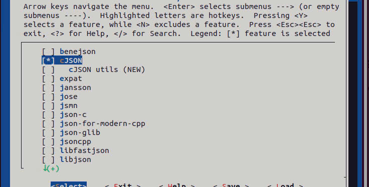
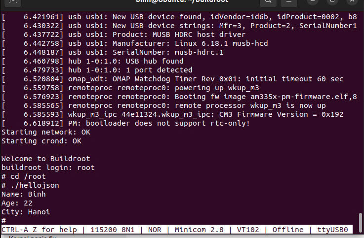
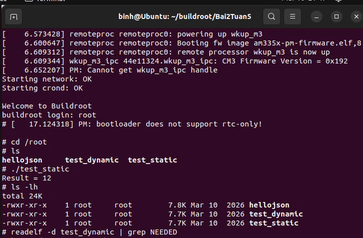
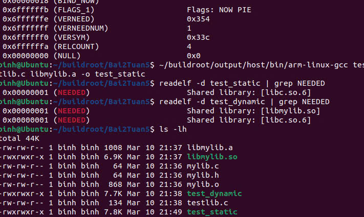
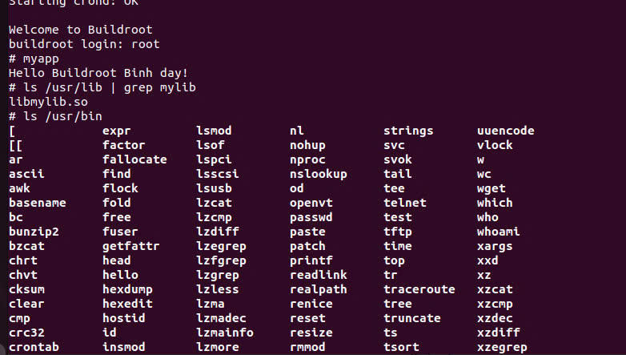

# 📌 BT05 – Biên dịch Ứng dụng và Thư viện với Buildroot

## 📖 Giới thiệu

Bài tập này hướng dẫn cách sử dụng Buildroot để:

* Biên dịch ứng dụng với thư viện có sẵn (cJSON)
* Tự tạo thư viện bằng C (static & dynamic)
* Đóng gói (package) thư viện và ứng dụng vào hệ điều hành

📟 Hệ thống sử dụng: BeagleBone Black (BBB)

---

## 🎯 Mục tiêu

* Hiểu cơ chế cross-compile
* Phân biệt thư viện tĩnh (.a) và thư viện động (.so)
* Hiểu cách dùng sysroot
* Tạo package tùy chỉnh
* Tích hợp ứng dụng vào hệ thống Linux nhúng

---

# 🧪 Bài 1: Biên dịch ứng dụng với thư viện cJSON

## 🔧 Bước 1: Bật cJSON trong Buildroot

```bash
make menuconfig
```

👉 Chọn:

```
Target packages ---> Libraries ---> JSON/XML ---> [*] cJSON
```

Build lại:

```bash
make
```

---

## 📌 Kết quả sau khi build

| Thành phần   | Đường dẫn                                                           |
| ------------ | ------------------------------------------------------------------- |
| Thư viện .so | output/target/usr/lib                                               |
| Header .h    | output/host/arm-buildroot-linux-gnueabihf/sysroot/usr/include/cjson |

---

## 📝 Bước 2: Viết chương trình

```c
#include <stdio.h>
#include <cjson/cJSON.h>

int main()
{
    const char *json_string = "{\"name\":\"Binh\",\"age\":22,\"city\":\"Hanoi\"}";

    cJSON *json = cJSON_Parse(json_string);

    if (json == NULL)
    {
        printf("JSON parse error\n");
        return -1;
    }

    cJSON *name = cJSON_GetObjectItem(json, "name");
    cJSON *age = cJSON_GetObjectItem(json, "age");
    cJSON *city = cJSON_GetObjectItem(json, "city");

    printf("Name: %s\n", name->valuestring);
    printf("Age: %d\n", age->valueint);
    printf("City: %s\n", city->valuestring);

    cJSON_Delete(json);

    return 0;
}
```


## ⚙️ Bước 3: Cross-compile

```bash
./output/host/bin/arm-buildroot-linux-gnueabihf-gcc HelloJSON.c -o HelloJSON \
-I./output/host/arm-buildroot-linux-gnueabihf/sysroot/usr/include/cjson \
-L./output/host/arm-buildroot-linux-gnueabihf/sysroot/usr/lib \
-lcjson
```

---

## 📌 Giải thích

* `-I`: đường dẫn header
* `-L`: đường dẫn thư viện
* `-lcjson`: link thư viện
  👉 Vì cross-compile nên phải dùng sysroot

---

## 🚀 Bước 4: Copy sang BBB

```bash
scp HelloJSON root@<IP_BBB>:/root/
```

Nếu thiếu thư viện:

```bash
scp output/target/usr/lib/libcjson.so* root@<IP_BBB>:/usr/lib/
```

---

## ▶️ Bước 5: Chạy

```bash
./HelloJSON
```

---

## 🔍 Giải thích

* `cJSON_CreateObject()` → tạo JSON
* `cJSON_AddStringToObject()` → thêm dữ liệu
* `cJSON_Print()` → in JSON
* `cJSON_Delete()` → giải phóng bộ nhớ

---

## 📷 Ảnh kết quả



---

# 🧪 Bài 2: Tạo thư viện cá nhân

## 📌 Bước 1: Tạo thư viện

* mylib.h
* mylib.c

---

## ⚙️ Bước 2: Biên dịch thư viện

### 🔹 Static (.a)

```bash
cd ~/buildroot/Bai2Tuan5

../output/host/bin/arm-buildroot-linux-gnueabihf-gcc -c mylib.c -o mylib.o
../output/host/bin/arm-buildroot-linux-gnueabihf-ar rcs libmylib.a mylib.o
```

---

### 🔹 Dynamic (.so)

```bash
cd ~/buildroot/Bai2Tuan5

../output/host/bin/arm-buildroot-linux-gnueabihf-gcc -fPIC -c mylib.c -o mylib.o
../output/host/bin/arm-buildroot-linux-gnueabihf-gcc -shared -o libmylib.so mylib.o
```

---

## 📂 Bước 3: Đưa vào sysroot

```bash
cd ~/buildroot

SYSROOT=$(pwd)/output/host/arm-buildroot-linux-gnueabihf/sysroot  

cp Bai2Tuan5/mylib.h $SYSROOT/usr/include/
cp Bai2Tuan5/libmylib.a Bai2Tuan5/libmylib.so $SYSROOT/usr/lib/
```

---

## 🧪 Bước 4: Compile app

### 🔹 Static

```bash
cd ~/buildroot/Bai2Tuan5

../output/host/bin/arm-buildroot-linux-gnueabihf-gcc app_test.c -o test_static -L. -lmylib -static
```

---

### 🔹 Dynamic

```bash
cd ~/buildroot/Bai2Tuan5

../output/host/bin/arm-buildroot-linux-gnueabihf-gcc app_test.c -o test_dynamic -L. -lmylib
```

---

## 🚀 Bước 5: Copy sang BBB

```bash
scp test_static test_dynamic root@<IP_BBB>:/root/
scp libmylib.so root@<IP_BBB>:/usr/lib/
```

---

## ▶️ Chạy

```bash
./test_static
./test_dynamic
```

---

## 📌 Kết luận

| Loại    | Ưu điểm      | Nhược điểm |
| ------- | ------------ | ---------- |
| Static  | Chạy độc lập | File lớn   |
| Dynamic | Nhẹ          | Cần .so    |

---

## 📷 Ảnh kết quả




---

# 🧪 Bài 3: Tích hợp vào Buildroot

## 📦 Bước 1: Tạo package

```bash
mkdir -p package/libkmt/src
```

### Config.in

```make
config BR2_PACKAGE_LIBKMT
    bool "libkmt"
```

---

## 📌 Giải thích

* BUILD_CMDS → build
* INSTALL_STAGING → sysroot
* INSTALL_TARGET → rootfs

---

## 🧩 Bước 2: Tạo app

```bash
mkdir -p package/myapp/src
```

👉 App sử dụng:

* cJSON
* libkmt

---

## 📦 Bước 3: Package app

Dependency:

* cjson
* libkmt

---

## ⚙️ Bước 4: Kích hoạt

Sửa:

```bash
package/Config.in
```

Thêm:

```make
menu "Custom Apps"
    source "package/libkmt/Config.in"
    source "package/my_app/Config.in"
endmenu
```

---

Chạy:

```bash
make menuconfig
```

Chọn:

```
Custom Apps ---> [*] my_app
```

---

## 🏗️ Build

```bash
make
```

---

## 💾 Flash SD

```bash
sudo dd if=output/images/sdcard.img of=/dev/sdX bs=4M status=progress conv=fsync
```

---

## ▶️ Chạy trên BBB

```bash
myapp
```

---

## 📷 Ảnh kết quả



---

# 🎓 Tổng kết

* Cross compile ứng dụng
* Tạo thư viện .a và .so
* Hiểu sysroot
* Tạo package
* Tích hợp vào hệ thống
→ Tự động build + tích hợp firmware
