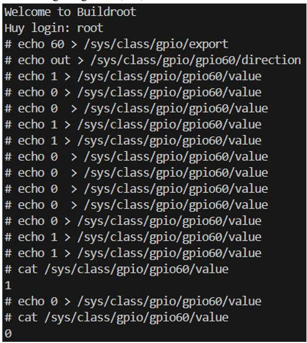
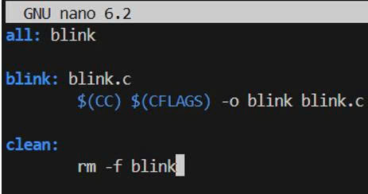
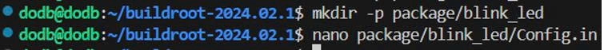
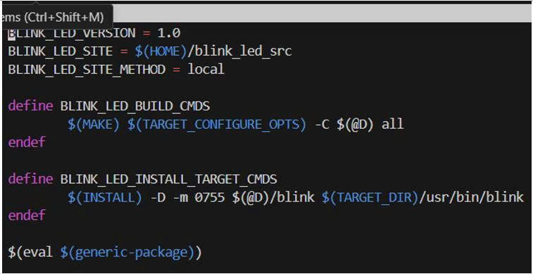
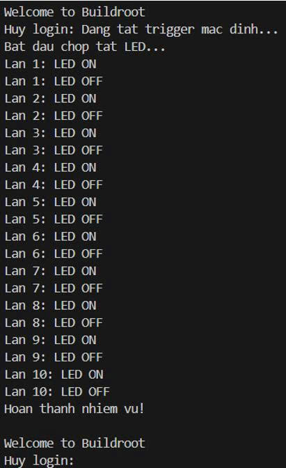

# 📘 Tuần 6 : Bài tập HDH Nhúng - Ứng dụng tổng hợp

---

## 🧩 Bài tập 1 : Giao tiếp với Device Driver từ ứng dụng

1. Bật BBB đã build hệ điều hành ở bài 5 và bật minicom  

2. "Đánh thức” chân GPIO (Lệnh Export):
```bash
echo 60 > /sys/class/gpio/export
Thiết lập chân GPIO đó ở chế độ output
echo out > /sys/class/gpio/gpio60/direction
Bật sáng bóng LED (ON)
echo 1 > /sys/class/gpio/gpio60/value
Đối với bóng LED trên bo mạch

👉 Link ảnh:


🧩 Bài tập 2 : Viết chương trình C/C++ và đóng gói vào Buildroot
🔹 Bước 1: Viết mã nguồn C và Makefile
Code C:
#include <stdio.h>
#include <stdlib.h>
#include <unistd.h>

int main() {
    system("echo 60 > /sys/class/gpio/export");
    system("echo out > /sys/class/gpio/gpio60/direction");

    while(1) {
        system("echo 1 > /sys/class/gpio/gpio60/value");
        sleep(1);
        system("echo 0 > /sys/class/gpio/gpio60/value");
        sleep(1);
    }

    return 0;
}
Makefile:
all:
	$(CC) blink_led.c -o blink_led

clean:
	rm -f blink_led
🔹 Bước 2: Tạo Gói (Package) trong Buildroot

Liên kết thư mục blink_led_src vào hệ thống Buildroot

Tạo file:

nano package/blink_led/blink_led.mk
Nội dung blink_led.mk:
BLINK_LED_VERSION = 1.0
BLINK_LED_SITE = $(TOPDIR)/package/blink_led
BLINK_LED_SITE_METHOD = local

define BLINK_LED_BUILD_CMDS
	$(MAKE) CC="$(TARGET_CC)" -C $(@D)
endef

define BLINK_LED_INSTALL_TARGET_CMDS
	$(INSTALL) -D -m 0755 $(@D)/blink_led $(TARGET_DIR)/usr/bin/blink_led
endef

$(eval $(generic-package))
🔹 Khai báo gói vào menu tổng của Buildroot

👉 Link ảnh:

https://github.com/your_repo/images/config_in.png
🔹 Kích hoạt gói trong Menuconfig
make menuconfig

👉 Link ảnh:

https://github.com/your_repo/images/menuconfig.png
🔹 Kết quả build

👉 Link ảnh:

https://github.com/your_repo/images/build_result.png
🧩 Bài tập 3 : Tự khởi chạy
🔹 Bước 1: Tạo file kịch bản tự chạy
cat > /etc/init.d/S99blink << 'EOF'
#!/bin/sh
/usr/bin/blink_led &
EOF
🔹 Bước 2: Cấp quyền thực thi
chmod +x /etc/init.d/S99blink
🔹 Bước 3: Hiển thị kết quả

