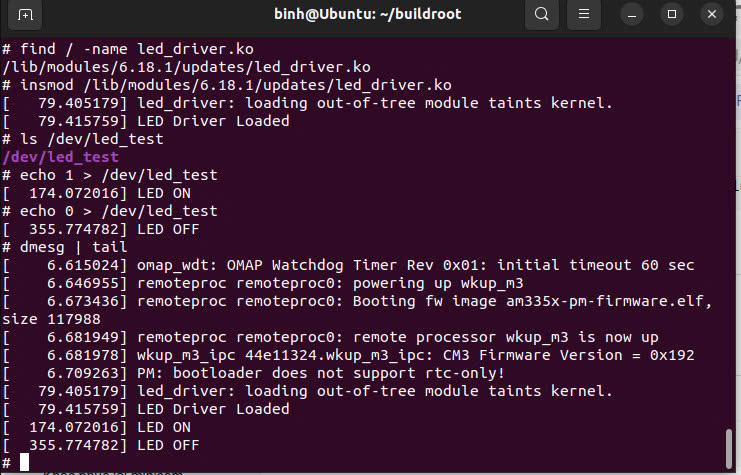
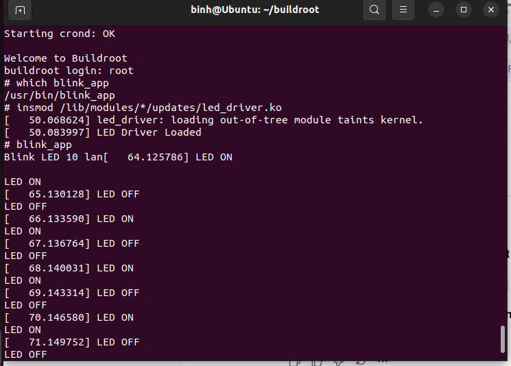
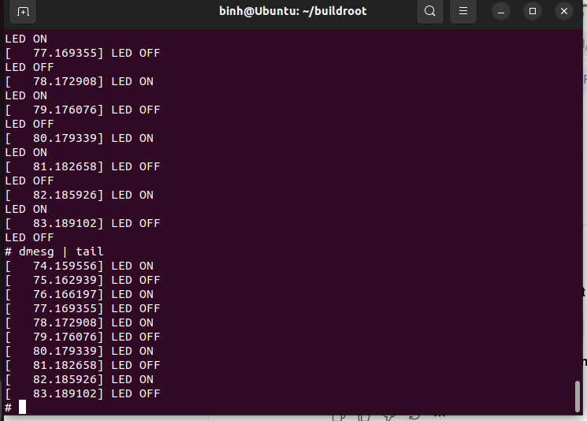
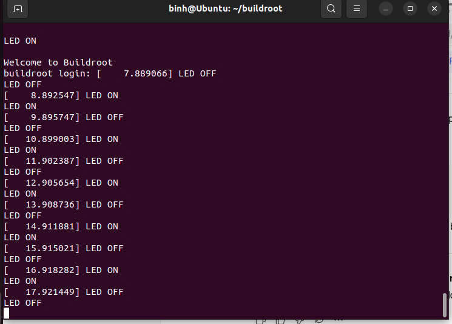

# Tuần 6: Linux LED Driver – Blink Application – Autostart Service

## Mục tiêu

* Viết **Linux Kernel Module (Device Driver)** điều khiển LED
* Tạo **device file `/dev/led_test`**
* Viết **User Application** giao tiếp với driver
* Tích hợp driver và application vào **Buildroot**
* Tạo **service tự động chạy khi boot**
* Chạy hệ thống trên **BeagleBone Black**

---

# Bài 1: Viết Linux LED Driver và tích hợp vào Buildroot

## Bước 1: Tạo driver

```bash
cd ~/buildroot/BT06/src
nano led_driver.c
```

### Nội dung `led_driver.c`

```c
#include <linux/module.h>
#include <linux/kernel.h>
#include <linux/fs.h>
#include <linux/uaccess.h>
#include <linux/gpio.h>
#include <linux/device.h>

#define DEVICE_NAME "led_test"
#define CLASS_NAME  "led_class"
#define GPIO_LED    525

static int major_number;
static struct class*  led_class  = NULL;
static struct device* led_device = NULL;

static ssize_t dev_write(struct file *file, const char __user *user_buffer,
                         size_t count, loff_t *ppos)
{
    char val;

    if (copy_from_user(&val, user_buffer, 1))
        return -EFAULT;

    if (val == '1') {
        gpio_set_value(GPIO_LED, 1);
        printk(KERN_INFO "LED ON\n");
    }
    else if (val == '0') {
        gpio_set_value(GPIO_LED, 0);
        printk(KERN_INFO "LED OFF\n");
    }

    return count;
}

static struct file_operations fops = {
    .owner = THIS_MODULE,
    .write = dev_write,
};

static int __init led_driver_init(void)
{
    major_number = register_chrdev(0, DEVICE_NAME, &fops);

    led_class = class_create(CLASS_NAME);
    led_device = device_create(led_class, NULL,
                               MKDEV(major_number, 0),
                               NULL, DEVICE_NAME);

    gpio_request(GPIO_LED, "led_gpio");
    gpio_direction_output(GPIO_LED, 0);

    printk(KERN_INFO "LED Driver Loaded\n");

    return 0;
}

static void __exit led_driver_exit(void)
{
    gpio_set_value(GPIO_LED, 0);
    gpio_free(GPIO_LED);

    device_destroy(led_class, MKDEV(major_number, 0));
    class_destroy(led_class);
    unregister_chrdev(major_number, DEVICE_NAME);

    printk(KERN_INFO "LED Driver Removed\n");
}

module_init(led_driver_init);
module_exit(led_driver_exit);

MODULE_LICENSE("GPL");
MODULE_AUTHOR("BBB Student");
MODULE_DESCRIPTION("Simple LED Driver");
```

Kiểm tra nội dung file:

```bash
cat led_driver.c
```

---

## Bước 2: Tạo package driver trong Buildroot

```bash
cd ~/buildroot
mkdir -p package/led_driver/src
```

Copy driver vào package:

```bash
cp ~/buildroot/BT06/src/led_driver.c ~/buildroot/package/led_driver/src/
```

---

## Bước 3: Tạo Makefile

```bash
cd ~/buildroot/package/led_driver/src
nano Makefile
```

Nội dung:

```make
obj-m += led_driver.o
```

---

## Bước 4: Tạo Config.in

```bash
cd ~/buildroot/package/led_driver
nano Config.in
```

```text
config BR2_PACKAGE_LED_DRIVER
    bool "led_driver"
    help
      Simple LED driver for BeagleBone Black
```

---

## Bước 5: Tạo file build `led_driver.mk`

```bash
nano led_driver.mk
```

```make
LED_DRIVER_VERSION = 1.0
LED_DRIVER_SITE = $(TOPDIR)/package/led_driver/src
LED_DRIVER_SITE_METHOD = local

$(eval $(kernel-module))
$(eval $(generic-package))
```

---

## Bước 6: Thêm package vào Buildroot

```bash
nano ~/buildroot/package/Config.in
```

Thêm dòng:

```text
source "package/led_driver/Config.in"
```

---

## Bước 7: Bật driver trong menuconfig

```bash
cd ~/buildroot
make menuconfig
```

Enable:

```
led_driver
```

---

## Bước 8: Build driver

```bash
make led_driver-rebuild
make
```

Sau khi build xong sẽ tạo:

```
led_driver.ko
```

---

## Bước 9: Ghi image vào SD card

```bash
sudo dd if=~/buildroot/output/images/sdcard.img of=/dev/sdb bs=4M status=progress
sync
```

Rút thẻ SD và cắm vào **BeagleBone Black**

---

## Bước 10: Kiểm tra driver trên BBB

Load module:

```bash
insmod /lib/modules/6.18.1/updates/led_driver.ko
```

Kiểm tra device:

```bash
ls /dev/led_test
```

Bật LED:

```bash
echo 1 > /dev/led_test
```

Tắt LED:

```bash
echo 0 > /dev/led_test
```

Xem log hệ thống:

```bash
dmesg | tail
```

Gỡ driver:

```bash
rmmod led_driver
```

---

# Bài 2: Viết Blink LED Application

## Bước 1: Tạo chương trình

```bash
cd ~/buildroot/package/bt06_blink
nano src/blink_app.c
```

### Code `blink_app.c`

```c
#include <stdio.h>
#include <fcntl.h>
#include <unistd.h>

#define DEVICE "/dev/led_test"

int main()
{
    int fd;

    fd = open(DEVICE, O_WRONLY);
    if(fd < 0)
    {
        printf("Khong mo duoc driver\n");
        return -1;
    }

    printf("Blink LED 10 lan\n");

    for(int i=0;i<10;i++)
    {
        write(fd,"1",1);
        printf("LED ON\n");
        sleep(1);

        write(fd,"0",1);
        printf("LED OFF\n");
        sleep(1);
    }

    close(fd);

    return 0;
}
```

---

## Bước 2: Tạo Config.in

```bash
nano Config.in
```

```text
config BR2_PACKAGE_BT06_BLINK
    bool "bt06 blink led app"
```

---

## Bước 3: Tạo file build

```bash
nano bt06_blink.mk
```

```make
BT06_BLINK_VERSION = 1.0
BT06_BLINK_SITE = $(TOPDIR)/package/bt06_blink/src
BT06_BLINK_SITE_METHOD = local

define BT06_BLINK_BUILD_CMDS
	$(TARGET_CC) $(@D)/blink_app.c -o $(@D)/blink_app
endef

define BT06_BLINK_INSTALL_TARGET_CMDS
	$(INSTALL) -D -m 0755 $(@D)/blink_app \
	$(TARGET_DIR)/usr/bin/blink_app
endef

$(eval $(generic-package))
```

---

## Bước 4: Thêm package vào Buildroot

```bash
nano ~/buildroot/package/Config.in
```

Thêm dòng:

```
source "package/bt06_blink/Config.in"
```

---

## Bước 5: Enable package

```bash
cd ~/buildroot
make menuconfig
```

Bật:

```
bt06 blink led app
```

---

## Bước 6: Build package

```bash
make
```

Kiểm tra ứng dụng:

```bash
ls output/target/usr/bin
```

---

## Bước 7: Ghi image vào SD

```bash
sudo dd if=output/images/sdcard.img of=/dev/sdb bs=4M status=progress
sync
```

---

## Bước 8: Test driver và application

```bash
insmod /lib/modules/*/updates/led_driver.ko
blink_app
```

LED sẽ nhấp nháy **10 lần**.


---

# Bài 3: Tự động chạy LED khi boot

## Bước 1: Tạo service

```bash
cd ~/buildroot/package/led_autostart
nano S95blink_service
```

### Nội dung service

```bash
#!/bin/sh

case "$1" in
  start)
    echo "Boot LED Service Started"
    modprobe led_driver
    /usr/bin/blink_app &
    ;;
  stop)
    echo "Stopping Blink LED Service"
    killall blink_app
    rmmod led_driver
    ;;
  *)
    echo "Usage: $0 {start|stop}"
    exit 1
esac
```

---

## Bước 2: Tạo Config.in

```bash
nano Config.in
```

```text
config BR2_PACKAGE_LED_AUTOSTART
    bool "blink_autostart"
    help
      Auto start led_driver and blink_app at boot
```

---

## Bước 3: Tạo file build

```bash
nano led_autostart.mk
```

```make
LED_AUTOSTART_VERSION = 1.0
LED_AUTOSTART_SITE = $(TOPDIR)/package/led_autostart
LED_AUTOSTART_SITE_METHOD = local

define LED_AUTOSTART_INSTALL_TARGET_CMDS
    $(INSTALL) -D -m 0755 $(@D)/S95blink_service \
        $(TARGET_DIR)/etc/init.d/S95blink_service
endef

$(eval $(generic-package))
```

---

## Bước 4: Thêm package vào Buildroot

```bash
cd ..
nano Config.in
```

Thêm dòng:

```
source "package/led_autostart/Config.in"
```

---

## Bước 5: Kích hoạt package

```bash
cd ~/buildroot
make menuconfig
```

Enable:

```
blink_autostart
```

---

## Bước 6: Build lại hệ thống

```bash
make
```

---

## Bước 7: Ghi image mới

```bash
sudo dd if=output/images/sdcard.img of=/dev/sdb bs=4M status=progress
sync
```

---

## Bước 8: Boot và kiểm tra

Kết nối UART:

```bash
sudo picocom -b 115200 /dev/ttyUSB0
```

Sau khi boot:

* Driver sẽ **tự động load**
* `blink_app` sẽ **tự chạy**
* LED sẽ **nhấp nháy tự động khi boot**

